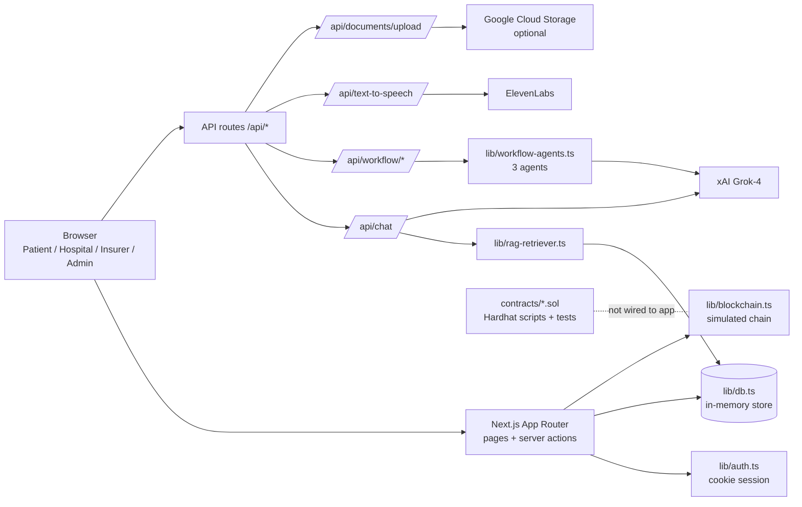

# ClaimifyEasy: Medical Insurance Claims SaaS

[](https://deepwiki.com/Professional50coder/ClaimifyEasy)

One workspace where patients, hospitals, insurers and admins move a medical insurance claim from submission to settlement.

| | |
|---|---|
| **Live app** | https://claimifyeasy-bice.vercel.app/ |
| **Source** | https://github.com/Professional50coder/ClaimifyEasy |
| **Docs (generated)** | https://deepwiki.com/Professional50coder/ClaimifyEasy |

**At a glance**

- **Four roles, one pipeline.** Patient submits. Hospital verifies. Insurer approves or rejects. Admin settles. Each step is enforced in code and written to an audit log.
- **AI where it reduces reading.** A Grok-4 chat assistant answers from claim data, with an optional "explain your reasoning" mode and ElevenLabs voice playback. A three-agent pipeline (document extraction, fraud scoring, decision) runs behind an API.
- **Blockchain settlement, prototyped.** The app simulates smart-contract deployment and actions. A separate set of Solidity contracts (core claims, escrow, Chainlink oracle, ZK verifier stub) with Hardhat tests sits in the repo.

## Contents

1. [The problem we solve](#the-problem-we-solve)
2. [Why we built it](#why-we-built-it)
3. [What it does](#what-it-does)
4. [Use cases](#use-cases)
5. [Product tour](#product-tour)
6. [How it works](#how-it-works)
7. [Architecture](#architecture)
8. [Models and AI used](#models-and-ai-used)
9. [Design decisions](#design-decisions)
10. [Feature matrix](#feature-matrix)
11. [Trust, security and limits](#trust-security-and-limits)
12. [Where it stands](#where-it-stands)
13. [Tech stack](#tech-stack)
14. [Repository layout](#repository-layout)
15. [Running locally](#running-locally)
16. [Testing](#testing)
17. [Deploying](#deploying)
18. [Roadmap](#roadmap)

## The problem we solve

A medical claim passes through at least three organisations: the patient, the hospital that treated them, and the insurer that pays. Each keeps its own view of the claim. Status lives in phone calls and email. Documents are re-sent. Nobody can see who acted last, or why a claim is stuck.

ClaimifyEasy gives every party the same claim record, the same status, and the same audit trail, with role-specific actions on top.

## Why we built it

Claim status is the question patients ask most and the one hospitals and insurers spend the most time answering. We wanted a single record that every party can read, a workflow that refuses out-of-order steps (no approval before hospital verification, no settlement before approval), and an assistant that answers status and coverage questions from the data instead of from a support queue. The seed data and Solidity tests use Indian names, hospitals and INR amounts because that is the market we designed against.

## What it does

| Capability | Problem it removes |
|---|---|
| Role-based dashboards for Patient, Hospital, Insurer, Admin | Each party sees only the claims and actions relevant to them |
| Claim lifecycle `submitted -> under_review -> approved -> settled` (or `rejected`) with role checks | Out-of-order or unauthorised status changes |
| Duplicate detection on submission (same patient + diagnosis within 30 days) | Accidental or repeated claims |
| Notifications and an audit log on every transition | "Who changed this, and when?" |
| Document upload (PDF, JPEG, PNG, DOC, DOCX, max 10 MB), optional Google Cloud Storage | Documents scattered across email |
| KPI dashboard and analytics (status, diagnosis, daily/monthly trends, amount buckets, average settlement days) | No shared view of throughput |
| Smart-contract screens (deploy, approve, reject, release payment, request settlement) plus Solidity and Rust examples | Opaque settlement step |
| AI chat assistant with retrieval over claims and documents, optional reasoning breakdown and confidence | Repetitive status and policy questions |
| Text-to-speech for assistant replies | Accessibility, hands-free use |
| Coverage calculator | Patients not knowing their out-of-pocket cost |
| Three-agent workflow API: document processing, fraud analysis, claims decision | Manual first-pass reading of claim documents |
| Integration test page at `/admin/integrations` | Unclear whether API keys are configured |

## Use cases

- **Patient** files a claim with diagnosis, amount, notes and documents, then tracks it and asks the assistant "where is my claim?".
- **Hospital** sees newly submitted claims and verifies them, which moves them to review.
- **Insurer** reviews verified claims, approves or rejects, and manages the linked smart contract.
- **Admin** settles approved claims and sees system-wide analytics and reports.
- **Anyone** estimates coverage before treatment with the calculator.

## Product tour

The app is designed to be explored from each role. The login page simulates this.

1. Open `/login`.
2. Use a one-click sign-in button:
   - **Sign in as Admin:** full access, including settlement actions and system-wide analytics.
   - **Sign in as Insurer:** review, approve or reject claims; manage smart contracts.
   - **Sign in as Hospital:** verify claims submitted by patients.
   - **Sign in as Patient:** submit new claims, upload documents, track status.
3. Navigate with the sidebar. Everyone gets Dashboard, Claims, Documents, Coverage Calculator, Messages and Settings. Hospital, Insurer and Admin also get Analytics, Reports and Smart Contracts.

Other routes worth visiting: `/workflow` (agent pipeline view), `/contracts/examples` (Solidity and Rust contract samples), `/admin/integrations` (runs live checks against the chat and TTS APIs), `/landing` (marketing page).

Screenshots used by the landing page are in [`public/images/screenshots/`](public/images/screenshots/).

## How it works

One claim, end to end, as implemented in `lib/db.ts`:

1. **Submit.** The patient's form posts to a server action, which calls `createClaim`. It rejects a missing diagnosis or non-positive amount, and rejects a duplicate (same patient and diagnosis within 30 days). Attached files are stored as documents linked to the claim. Status is `submitted`. The patient, all hospital, insurer and admin users are notified. `CLAIM_SUBMITTED` is written to the audit log.
2. **Verify.** A hospital user calls `transitionClaimStatus({ action: "verify" })`. Only the `hospital` role may do this. `hospitalVerified` becomes true and status becomes `under_review`.
3. **Decide.** An insurer approves or rejects. Approval is refused unless the hospital has verified the claim.
4. **Settle.** An admin settles. Only `approved` claims can be settled.
5. **Contract path (optional).** An insurer or admin can deploy a simulated contract for the claim. Approving, rejecting or releasing payment on the contract moves the linked claim to `approved`, `rejected` or `settled`, with `SC_*` audit entries.

Every step notifies the patient and appends an audit record.

The **agent workflow** is a separate path, exposed as an API:

1. `POST /api/workflow/execute` with `{ claimId, documents: [{ text, type }] }` returns `202` and an `executionId` immediately.
2. In the background, `lib/workflow-executor.ts` runs three agents in order: document processing extracts claimant, incident and amount fields as JSON; fraud analysis returns a 0-100 score, risk level, flags and reasoning; claims processing returns a decision (`approved`, `denied`, `under_review`), approval percentage and amount.
3. Poll `GET /api/workflow/status/[id]` for progress and `GET /api/workflow/results/[id]` for outputs and timing.

## Architecture



| Component | Path | Role |
|---|---|---|
| Pages and layouts | `app/` | Dashboard, claims, documents, analytics, reports, contracts, workflow, coverage calculator, messages, settings, landing |
| Auth | `lib/auth.ts`, `app/(auth)/login` | Cookie session (`mi_claims_session`), `signIn`, `signOut`, `hasRole` |
| Data | `lib/db.ts`, `lib/types.ts` | Seeded in-memory store held on `globalThis`; users, claims, docs, notifications, audit log, contracts, analytics queries |
| Contracts API | `lib/contracts-api.ts`, `lib/blockchain.ts` | Simulated deploy, actions, verification, state and audit trail with generated addresses and tx hashes |
| Chat | `app/api/chat`, `lib/rag-retriever.ts`, `components/chat/` | Retrieval over claims and docs, Grok-4 answer, optional reasoning parse |
| Agent workflow | `app/api/workflow/*`, `lib/workflow-executor.ts`, `lib/workflow-agents.ts` | Async three-stage pipeline with in-memory execution store |
| Voice | `app/api/text-to-speech`, `hooks/use-text-to-speech.ts` | ElevenLabs `eleven_multilingual_v2`, returns base64 MP3 |
| Storage | `app/api/documents/upload`, `lib/gcp-storage.ts` | Validates type and size; uploads to GCS when configured |
| Coverage | `app/coverage-calculator`, `lib/coverage-agents.ts` | Rule-based coverage estimate |
| Solidity | `contracts/`, `scripts/`, `test/` | `MedicalInsuranceCore`, `EscrowContract`, `AdvancedEscrow`, `ChainlinkOracle`, `ZKPVerifier`, `MockERC20` |

**API routes**

| Method and path | Purpose |
|---|---|
| `GET /api/auth/check` | Current user |
| `POST /api/chat` | Assistant reply; `explainable: true` adds reasoning, confidence, data points |
| `POST /api/text-to-speech` | Text to MP3 (base64 data URL) |
| `POST /api/documents/upload` | Upload one file |
| `GET /api/documents` | List current user's uploaded documents |
| `GET /api/docs/[id]` | Stream a stored claim document |
| `POST /api/workflow/execute` | Start agent pipeline |
| `GET /api/workflow/status/[id]` | Pipeline progress |
| `GET /api/workflow/results/[id]` | Pipeline outputs |

**Environment variables** (read in code)

| Variable | Used by |
|---|---|
| `XAI_API_KEY` | Chat and workflow agents |
| `ELEVENLABS_API_KEY` | Text-to-speech |
| `GCP_BUCKET_NAME` | Upload target bucket (default `claims-documents`); also enables GCS upload |
| `GOOGLE_CLOUD_PROJECT` | GCS project; also enables GCS upload |
| `GOOGLE_CLOUD_CREDENTIALS` | Service-account JSON as a string |

**Dataset.** `Datasets/claimifyeasy_insurance_dataset_v3_10000_claims.csv` holds 10,000 synthetic claim rows (patient and provider region, specialty, insurer, policy type, ICD-10, CPT, amounts, fraud flag, verification/review/settlement dates, processing days, status, rejection reason). The app does not load it yet.

## Models and AI used

| Where | Model | Why |
|---|---|---|
| Chat assistant (`/api/chat`) | xAI `grok-4` via Vercel AI SDK (`@ai-sdk/xai`) | General reasoning over injected claim context; the explainable mode asks for a "Reasoning" section and a HIGH/MEDIUM/LOW confidence, which the route parses into structured fields |
| Workflow agents (`lib/workflow-agents.ts`) | xAI `grok-4` | Each agent is prompted to return strict JSON; outputs are clamped (fraud score 0-100, confidence 0-1) |
| Voice | ElevenLabs `eleven_multilingual_v2` | Multilingual speech for assistant replies |
| Retrieval | No embedding model | `lib/rag-retriever.ts` scores claims and documents by word-overlap (Jaccard) similarity and injects the top matches into the prompt |
| Coverage calculator | None at runtime | The page calls the deterministic `calculateBasicCoverage`. An `analyzeCoverage` function using OpenAI `gpt-4-turbo` with a Zod schema exists in `lib/coverage-agents.ts` but is not called |

Earlier versions of this README described the assistant as Google Gemini. The current code uses Grok-4; `@ai-sdk/google` is still listed in `package.json` but is not imported.

Failure handling is deliberate: if the fraud agent fails it returns a neutral score of 50 with `analysis_error`; if the decision agent fails it returns `under_review` with `reviewRequired: true`. A model error never produces an automatic approval.

## Design decisions

| Decision | Why | Trade-off |
|---|---|---|
| In-memory store seeded on `globalThis` | Zero setup; the demo runs without a database | Data resets on restart and is not shared across serverless instances |
| Mock cookie session with one-click role logins | Lets a reviewer see all four roles in a minute | Not real authentication (see limits) |
| Business rules in `transitionClaimStatus`, not in the UI | One place enforces role and ordering rules | Rules are hard-coded, not configurable per insurer |
| Simulated chain in `lib/blockchain.ts`, Solidity kept separate | UI and workflow can be built before contracts are deployed | Addresses and tx hashes shown in the app are random, not on-chain |
| Async workflow API returning `202` + polling | Agent calls are slow; the request should not block | Execution state is in memory and lost on restart |
| Prompted JSON + regex extraction for agents | Works with any chat model | Less robust than schema-constrained output |
| Word-overlap retrieval instead of embeddings | No vector store or embedding cost | Misses synonyms and paraphrases |
| Optional GCS upload with silent fallback | Uploads work locally without cloud credentials | Without GCS, upload returns metadata only; the file is not persisted |

## Feature matrix

| Feature | Patient | Hospital | Insurer | Admin |
|---|:-:|:-:|:-:|:-:|
| Submit claim, upload documents | Yes | | | |
| See own claims | Yes | | | All |
| See submitted / unverified claims | | Yes | Yes | Yes |
| Verify claim | | Yes | | |
| Approve / reject claim | | | Yes | |
| Settle claim | | | | Yes |
| Approve / reject / release contract payment | | | Yes | Yes |
| Analytics, reports, smart contracts in sidebar | | Yes | Yes | Yes |
| Chat assistant, coverage calculator, messages | Yes | Yes | Yes | Yes |

## Trust, security and limits

This is a prototype. Do not put real patient data in it.

- **Authentication is demo-grade.** Sessions exist to let a reviewer switch roles quickly; they are not production authentication. Do not use this deployment with real claims, documents or personal data.
- **Route-level authorisation is incomplete.** Production use requires signed sessions and an authorisation check on every API route.
- **Data is ephemeral.** Claims, documents, contracts and workflow executions live in process memory.
- **Blockchain is simulated in the app.** `ZKPVerifier._performZKVerification` is a placeholder that only checks the hash is non-zero.
- **AI output is advisory.** Fraud scores and decisions come from a general-purpose LLM, not a trained fraud model. Treat them as a first pass for a human reviewer.
- **Build checks are off.** `next.config.mjs` sets `ignoreBuildErrors` and `ignoreDuringBuilds`; `tsc-out.txt` records outstanding type errors.
- **Secrets.** API keys are read from environment variables only. `.env*.local` is git-ignored.

## Where it stands

- The web app is deployed at https://claimifyeasy-bice.vercel.app/.
- The role-based claim lifecycle, analytics, contract screens, chat, TTS, upload and coverage calculator are implemented against the in-memory store.
- The agent workflow API is implemented; the `/workflow` page and claim detail tabs currently render sample data rather than calling it.
- The Solidity contracts, deploy scripts (local, Sepolia) and tests are present, but the repo has no `hardhat.config` and Hardhat, OpenZeppelin and Chainlink are not in `package.json`, so they do not run as checked in.
- Extended notes on individual integrations live in the root `*.md` files (start with `DOCUMENTATION_INDEX.md`, `QUICK_START.md`, `GCP_SETUP.md`, `ELEVENLABS_INTEGRATION.md`, `RAG_CHATBOT.md`, `WORKFLOW_INTEGRATION_GUIDE.md`, `COVERAGE_CALCULATOR_GUIDE.md`, `TEST_SCENARIOS.md`).

## Tech stack

- **Framework:** [Next.js](https://nextjs.org/) 15 (App Router & RSC), React 19
- **Language:** [TypeScript](https://www.typescriptlang.org/)
- **Styling:** [Tailwind CSS](https://tailwindcss.com/) 4
- **UI components:** [shadcn/ui](https://ui.shadcn.com/) on Radix UI, lucide-react icons
- **AI:** [Vercel AI SDK](https://sdk.vercel.ai/) with xAI Grok-4; ElevenLabs for speech
- **Charting:** [Recharts](https://recharts.org/)
- **Forms:** [React Hook Form](https://react-hook-form.com/), Zod
- **Storage:** Google Cloud Storage (optional)
- **Data/state:** in-memory mock database (`lib/db.ts`) and React state/context
- **Authentication:** mock cookie-based session management (`lib/auth.ts`)
- **Contracts:** Solidity ^0.8.20, OpenZeppelin, Chainlink, Hardhat + ethers + chai (tests and scripts)
- **Analytics:** `@vercel/analytics`

## Repository layout

```
app/                    Pages, layouts, API routes (App Router)
  (auth)/login/         Route group for authentication pages
  api/                  chat, auth/check, documents, docs/[id], text-to-speech, workflow/*
  dashboard/ claims/ contracts/ analytics/ reports/ documents/
  coverage-calculator/ workflow/ messages/ settings/ landing/ admin/integrations/
components/             Reusable React components
  ui/                   shadcn/ui primitives
  landing/              Marketing page sections
  chat/                 Chat widget and explanation display
lib/
  auth.ts               Mock authentication
  db.ts                 In-memory database and data access
  contracts-api.ts      Functions for the mock blockchain layer
  blockchain.ts         Simulated deploy / actions / audit trail
  sample-data.ts        Sample data generators and smart contract code examples
  workflow-*.ts         Agent pipeline
  rag-retriever.ts      Context retrieval for chat
  coverage-agents.ts    Coverage rules and calculator
  gcp-storage.ts        Google Cloud Storage client
  integration-tests.ts  Integration checks
hooks/                  Custom hooks (use-toast, use-text-to-speech, use-mobile)
contracts/              Solidity contracts
scripts/                Hardhat deploy and verify scripts
test/                   Hardhat contract tests
Datasets/               Synthetic 10,000-claim CSV
public/                 Static assets and landing-page images
```

## Running locally

**Prerequisites:** Node.js v18 or newer, [pnpm](https://pnpm.io/installation).

1. Clone the repository:
   ```bash
   git clone https://github.com/professional50coder/claimifyeasy.git
   ```
2. Navigate to the project directory:
   ```bash
   cd claimifyeasy
   ```
3. Install dependencies:
   ```bash
   pnpm install
   ```
4. (Optional) Create `.env.local` for AI, voice and storage:
   ```bash
   XAI_API_KEY=your_xai_key_here
   ELEVENLABS_API_KEY=your_elevenlabs_key_here
   # GCP_BUCKET_NAME=claims-documents
   # GOOGLE_CLOUD_PROJECT=your_project
   # GOOGLE_CLOUD_CREDENTIALS='{"type":"service_account", ...}'
   ```
   Without these, the claims workflow, dashboards and calculator still work; chat, TTS and the agent workflow return errors.
5. Run the development server:
   ```bash
   pnpm dev
   ```

Open [http://localhost:3000](http://localhost:3000). `/` redirects to `/dashboard` when signed in.

Other scripts: `pnpm build`, `pnpm start`, `pnpm lint`.

## Testing

- **App:** there is no automated test runner in `package.json`. `/admin/integrations` runs live checks for environment, chat, explainable chat and TTS. Manual scenarios are in `TEST_SCENARIOS.md` and `VERIFICATION_CHECKLIST.md`.
- **Contracts:** `test/EscrowContract.test.js` and `test/MedicalInsuranceCore.test.js` are Hardhat/chai tests. To run them you need to add a Hardhat config and install `hardhat`, `@nomicfoundation/hardhat-toolbox` (or ethers + chai), `@openzeppelin/contracts` and `@chainlink/contracts`, then run `npx hardhat test`.

## Deploying

- **Web:** the live app runs on Vercel. Set the environment variables above in the project settings. GCS setup is described in `GCP_SETUP.md`.
- **Contracts:** `scripts/deploy.js`, `scripts/deploy-test.js` (local Hardhat network), `scripts/deploy-sepolia.js` (Sepolia, using Sepolia USDC) and `scripts/verify-contracts.js` (Etherscan verification) are written for Hardhat and need the setup described under Testing.

## Roadmap

Grounded in the gaps above:

- Replace the in-memory store with a persistent database.
- Replace mock auth with signed sessions and add auth checks to every API route.
- Wire the `/workflow` page and claim detail tabs to `/api/workflow/*` instead of sample data.
- Add a Hardhat config and contract dependencies so tests and deploys run from a clean clone; connect the app's contract screens to deployed contracts.
- Replace the ZK verifier placeholder with real proof verification.
- Use the 10,000-claim dataset for analytics and to evaluate the fraud agent.
- Re-enable TypeScript and ESLint checks in builds.
